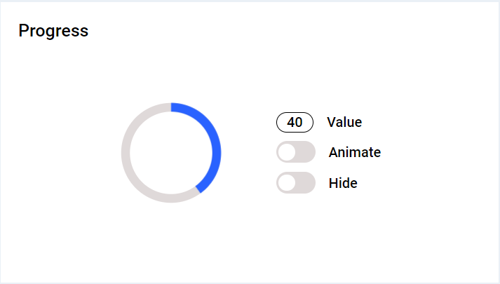

# Кастомный лоадер

Разработан прототип блока Progress, для отображения состояния выполнения процессов и их прогресса.


## Оглавление

- [Технологии](#стек)
- [Инструкция по установке](#инструкция)

## Стек

- HTML
- CSS
- JavaScript

## Инструкция

Для запуска необходимо расширение 'Live Server'!

Склонируйте репозиторий

```
git clone https://github.com/NikolayDimitriev/circle-progress.git
```

Перейдите в папку проекта

```
cd circle-progress
```

Запустите c помощью плагина 'Live Server'
